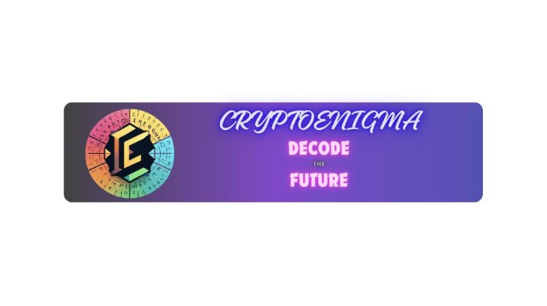
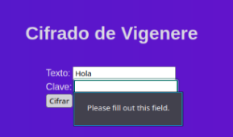

**CRYPTOENIGMA   User Manual![ref1]**

**Version 1.0 11/28/2023**

**Juan Jose Figueroa Padilla Tania Vanesa Vasquez Alejandro Higuera Castro**

UM Version 1.0 1 CryptoEnigma![ref1]

Universidad Nacional de Colombia List of Tables![ref2]

**Table of Contents**

1. [**Introduction 1**](#_page2_x72.00_y72.00)
   1. [Overview 1](#_page2_x72.00_y500.92)
2. [**Getting Started 2**](#_page4_x72.00_y72.00)
1. [Installation 2](#_page4_x72.00_y100.15)
1. [Running the Application 2](#_page5_x72.00_y169.17)
1. [Accessing the Application 3](#_page6_x72.00_y90.65)
1. [System Organization & Navigation 3](#_page6_x72.00_y196.25)
1. [Contact Support 3](#_page6_x72.00_y314.51)
3. [**Using the System 4**](#_page7_x72.00_y72.00)

[3.1 Encrypt/Decrypt 4](#_page7_x72.00_y131.45)

4. [**Troubleshooting & Support 5**](#_page9_x72.00_y72.00)
1. [Common Issues and Solutions: 5](#_page9_x72.00_y144.10)
1. [Error Messages: 5](#_page10_x72.00_y176.98)
- ["Incomplete Form Submission": Ensure all required fields are filled before submitting the form. 5](#_page10_x72.00_y209.99)
- ["Invalid Key": Review the encryption method's key requirements and provide a valid key. 5](#_page10_x72.00_y235.29)
3. [Support 6](#_page10_x72.00_y335.18)

Universidad Nacional de Colombia![ref1]

1. **Introduction![ref1]**

This User Manual (UM) provides the information necessary for users to effectively use the *CryptoEnigma* application.

*CryptoEnigma* borned as the project for the **Introduction to cryptography** subject teached for Agustin Moreno Canadas. Our purpose is to implement an offline application that can implement the different cryptosystems learned throughout the semester for text and some for images as well.

All users will be able to write text or upload images and encrypt them using the cryptosystem available in the application. As output the user will receive the encrypted (or decrypted) file and the key that has been used to encrypt it. In some cryptosystems instead of the decrypt option, the app will return a frequency analysis of the text n-grams in order to give a hand to the user with the text decipher.

This is an open source project, with no licenses or privacy considerations associated with it.

Figura 1: Logo

**1.1 Overview**

*CryptoEnigma* is a user-friendly platform designed to facilitate encryption and decryption processes for text and images. It offers a seamless experience for users interested in enhancing the security of their digital communication and data.

The Key Features of our application are:

- **Versatile Encryption and Decryption:** Employ various cryptographic techniques for securing both text messages and images.
- **Visual Impact on Image Encryption:** For image encryption, users have the unique opportunity to visualize the impact of encryption on image data.
- **Frequency Analysis Exploration:** Dive into the functionality of frequency analysis to enhance understanding.
- **Transparent Key Management:** Users receive detailed information about the encryption or decryption key employed in the process.

System Architecture:

- Designed as a desktop application, CryptoEnigma operates locally without the need for internet connectivity. The application thrives on a 64-bit architecture, requiring modest memory and RAM values for optimal performance.

User Access Mode:

- Upon launching the application, users gain access to a graphical user interface (GUI) within seconds. The system interface is designed for intuitive interaction, featuring user-friendly forms and visualizations. This ensures that encryption and decryption processes are not only straightforward but also align with clear datatype instructions presented in visually accessible boxes.
2. **Getting Started![ref1]**
1. **Installation**

Before installing *CryptoEnigma*, ensure you have the following:

- Python (3.6 or higher) installed on your machine.
- Pip (Python package installer) installed.
- Electron (Framework) installed
- Node.js (21.2.0) installed.
- npm (10.2.4) installed

For downloading the last three resources follow the next link: <https://www.electronjs.org/es/docs/latest/tutorial/quick-start>

For downloading python: <https://www.python.org/downloads/>

The steps to install *CryptoEnigma* are:

1\. Clone the project repository from GitHub:

|
Python

git clone https://github.com/JJFigpad/Introduction-to-Criptography-Project.git
|
| - |
|2\. Navigate to the project directory:|
|
Python

cd /\*Name of your folder\*/
|
|3\. Install the required Python packages using pip:|
|
Python

pip install -r requirements.txt
|

4\. Apply migrations:

Python

python manage.py migrate

2. **Running the Application**

Run the application using the next commands in two different terminals: the first one should be written in the actual folder, and the second one in the folder Electron of the project folder.

Python

python manage.py runserver npm start

3. **Accessing the Application**

The main page will prompt the user the complete menu with all the cryptosystems available for use in its different groups. When the user selects one, the new window will prompt the user to input text or upload an image. Choose the action (encrypt/decrypt) and click "Submit" to perform the selected operation.

The user will view the result and the rest of the output on the same page.

4. **System Organization & Navigation**

The idea of the navigation inside the application is to select the type of cipher that is required to perform the encryption operation, just as **Classics** or **Block**, and inside the type there will be the distincts ciphers available. To return to the original windows the user just has to select the **Menu** option.

It is not possible to travel from one cipher to another, in order to maintain an order between the Menu and the rest of possible actions of the user.

5. **Contact Support**

If you encounter issues not covered in this manual or need further assistance, please contact our support team at jufigueroap@unal.edu.co. Provide detailed information about the problem, including error messages, and we will respond as soon as possible.

3. **Using the System![ref1]**

The following subsections provide detailed, step-by-step instructions on how to use the various functions or features of the *CryptoEnigma* application.

**3.1 Encrypt/Decrypt**

The Encrypt/Decrypt functionality of the application allows users to secure and decode text messages and images using various cryptographic techniques. This section provides an explanation of how to use this core functionality and the expected outputs.

In the text Encryption and Decryption part we have the following usage Instructions:

- **Access the Text Encryption/Decryption Section:** choose between "Encrypt" and "Decrypt" based on your desired action. For encryption, input the text you want to encrypt. For decryption, provide the encrypted text. If applicable, provide additional parameters such as a key value for encryption.
- **Submit and View Result:** Click the "Submit" button to process the input. View the result on the page, showing the encrypted or decrypted text. After submitting the text, a button with the possibility of returning to the menu will show up.

Figure 2

For the images Encryption and Decryption we have:

- **Access the Image Encryption/Decryption Section:** Choose between "Encrypt" and "Decrypt" based on your desired action.
- **Upload Image:** For encryption, upload the image you want to encrypt. For decryption, upload the encrypted image.
- **Submit and View Result:** Click the "Submit" button to process the input. View the result on the page, showing the encrypted or decrypted image. After submitting the image, a button with the possibility of returning to the menu will show up.

Expected Outputs:

- For text Encryption/Decryption the expected output is the encrypted/decrypted text using the selected encryption method. The idea is to allow visualization, displaying the original and encrypted text for comparison. In both cases the key used for the algorithm is shown.
- In decryption the output also includes in some cases a n-grams frequency analysis.
- For Image Encryption the output is the encrypted image using the chosen encryption technique. To Visualize it there will be a side-by-side display of the original and encrypted images.
4. **Troubleshooting & Support**

This section provides guidance on common issues and troubleshooting steps for the Encryption Web Application. If you encounter difficulties or unexpected outcomes, refer to the following information for assistance.

1. **Common Issues and Solutions:**
1. **Incomplete Data Submission:**

**Issue:** Failing to fill in all required fields when encrypting or decrypting text. **Solution:** Ensure all mandatory fields are completed before submitting the form.

Figure 3

2. **Incorrect Key or Parameters:**

**Issue:** Providing an incorrect key or parameters for encryption algorithms.

**Solution:** Double-check the encryption method's requirements and provide accurate keys or parameters.

3. **Invalid Image Format:**

**Issue:** Attempting to upload an image in a format other than .png.

**Solution:** Use .png format for image encryption and ensure proper file selection.

4. **Deciphering a Non-Ciphered Image:**

**Issue:** Trying to decrypt an image that has not been previously encrypted.

**Solution:** Verify that the selected image has undergone encryption before attempting decryption.

5. **Unsupported File Types:**

**Issue:** Uploading files other than text or image files.

**Solution:** Restrict uploads to valid text or image file formats (e.g., .txt for text, .png for images).

Figure 4

2. **Error Messages:**
- **"Incomplete Form Submission":** Ensure all required fields are filled before submitting the form.
- **"Invalid Key":** Review the encryption method's key requirements and provide a valid key.
- **"Unsupported File Format":** Check the file format and use the recommended format for text and image files.
- **"Image Not Encrypted":** Confirm that the selected image has undergone encryption before attempting decryption.
3. **Support**

**Table 1 - Support Points of Contact**

|**Contact**|**Organization**|**Email**|**Role**|**Responsibility**|
| - | - | - | - | - |
|*Juan Jose Figueroa*|*Universidad Nacional de Colombia*|*jufiguer oap@u nal.edu. co*|*Owner*|*Support*|
|*Tania Vanesa Vasquez*|*Universidad Nacional de Colombia*|*tvvasqu ezg@u nal.edu. co*|*Owner*|*Support*|
|*Alejandro Higuera Castro*|*Universidad Nacional de Colombia*|*ahiguer ac@un al.edu.c o*|*Owner*|*User guidance*|

UM Version 1.0 9 CryptoEnigma![ref2]

CMS TLC Appendix E: Notes to the Author/Template Instructions![ref2]

**Appendix B: Glossary**

**Table 3 - Glossary**

|**Term**|**Definition**|**Reference**|
| - | - | - |
|*n-gram*|*is a set of n consecutive elements in a text document, which may include words, numbers, symbols, and punctuation.*|*https://la.mathworks.com/discov ery/ngram.html*|

UM Version 1.0 10 CryptoEnigma![ref2]

[ref1]: Aspose.Words.acad4a56-70fd-43ae-814b-d2e22ded560e.002.png
[ref2]: Aspose.Words.acad4a56-70fd-43ae-814b-d2e22ded560e.003.png
